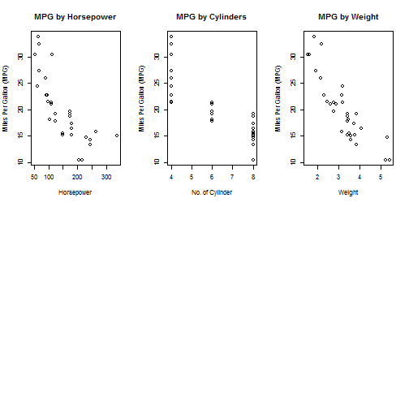

## Overview
The prediction is for Miles per Gallon (MPG) based on the input of Gross Horsepower, No. of Cylinders and Weight entered by the users.

The ShinyApp has been deployed. Click <a href="https://wayhuay.shinyapps.io/Developing_Data_Products">here</a> to launch the App.

--- .class #id 

## Dataset
mtcars dataset is be used in the Miles per Gallon (MPG) prediction.

```r
data(mtcars)
head(mtcars, 5)
```

```
##                    mpg cyl disp  hp drat    wt  qsec vs am gear carb
## Mazda RX4         21.0   6  160 110 3.90 2.620 16.46  0  1    4    4
## Mazda RX4 Wag     21.0   6  160 110 3.90 2.875 17.02  0  1    4    4
## Datsun 710        22.8   4  108  93 3.85 2.320 18.61  1  1    4    1
## Hornet 4 Drive    21.4   6  258 110 3.08 3.215 19.44  1  0    3    1
## Hornet Sportabout 18.7   8  360 175 3.15 3.440 17.02  0  0    3    2
```

<h2>Source</h2>
Henderson and Velleman (1981), Building multiple regression models interactively. Biometrics, 37, 391–411.

--- .class #id 

## Model
Linear model is used in this course project to predict the fuel efficiency of Miles per Gallon (MPG).

```r
Model <- lm(mpg ~ hp + cyl + wt, data=mtcars)

mpg <- function(hp, cyl, wt) {
  Model$coefficients[1] + Model$coefficients[2] * hp + 
    Model$coefficients[3] * cyl + Model$coefficients[4] * wt
}
```

--- .class #id 

## Graph Plots

```r
par(mfrow = c(2, 3))
plot(mtcars$hp, mtcars$mpg, main="MPG by Horsepower", xlab = "Horsepower"
     , ylab = "Miles Per Gallon (MPG)")
plot(mtcars$cyl, mtcars$mpg, main="MPG by Cylinders", xlab = "No. of Cylinder"
     , ylab = "Miles Per Gallon (MPG)")
plot(mtcars$wt, mtcars$mpg, main="MPG by Weight", xlab = "Weight"
     , ylab = "Miles Per Gallon (MPG)")
```

 
